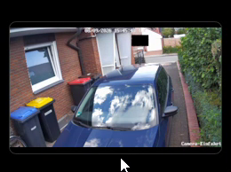
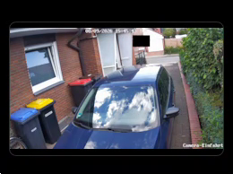

# HomeCam Monitor

<p align="center">
  
</p>

<p align="center">
  Ein rahmenloser Windows-Kameramonitor für stabile RTSP-Livestreams – unabhängig vom Home-Assistant-Dashboard.
</p>

<p align="center">
  
</p>

HomeCam Monitor verwendet die mpv-Video-Engine mit Direct3D 11. Das Fenster bleibt auf Wunsch im Vordergrund, verbindet einen abgebrochenen Stream automatisch neu und kann zwischen mehreren Kameras umschalten.

## Funktionen

- rahmenloses Kamerafenster mit abgerundeten Ecken
- Bedienleiste nur bei Mausbewegung sichtbar
- Fenster durch Ziehen direkt im Kamerabild verschieben
- Größe an allen Kanten und Ecken ändern
- festes 16:9-Seitenverhältnis ohne Abschneiden des Kamerabildes
- Doppelklick zum Wechsel zwischen Fenster und Vollbild
- mehrere RTSP-, HTTP- oder HTTPS-Kameras
- Snapshot direkt im Windows-Bilderordner
- automatische Wiederverbindung nach einem Stream- oder Playerabbruch
- vorsorglicher Stream-Neustart nach fünf Minuten gegen zunehmende Verzögerung
- gespeicherte Fensterposition, Fenstergröße und Kameraauswahl
- optional „Immer im Vordergrund“ und Windows-Autostart

## Installation

1. In GitHub **Actions → Windows-Build** öffnen.
2. Den neuesten erfolgreichen Lauf auswählen.
3. Unter **Artifacts** die Datei `HomeCamMonitor-win-x64` herunterladen.
4. Das ZIP vollständig entpacken.
5. `HomeCamMonitor.exe` starten.

> Wichtig: Nicht nur die EXE kopieren. Der komplette entpackte Ordner einschließlich `mpv.exe` wird benötigt.

## Kameras einrichten

Beim ersten Start öffnet sich die Kameraliste. Für jede Kamera werden ein frei wählbarer Name und die vollständige Streamadresse eingetragen.

| Name | Beispieladresse |
|---|---|
| Einfahrt | `rtsp://192.168.x.x:8554/Einfahrt` |
| Garten | `rtsp://192.168.x.x:8554/Garten` |
| Garage | `rtsp://192.168.x.x:8554/Garage2` |

Die Beispiele verwenden den RTSP-Ausgang von go2rtc auf Port `8554`. Eine `onvif://`-Adresse gehört in die go2rtc-Konfiguration und ist keine direkt abspielbare Adresse für HomeCam Monitor.

Kameras lassen sich später über das Zahnrad ergänzen, ändern oder löschen. Die lokale Konfiguration liegt unter `%LOCALAPPDATA%\HomeCamMonitor\settings.json`.

## Bedienung

<p align="center">
  
</p>

Die Bedienleiste erscheint bei einer Mausbewegung und verschwindet nach kurzer Zeit wieder.

| Bedienung | Funktion |
|---|---|
| Im Kamerabild ziehen | Fenster verschieben |
| Kante oder Ecke ziehen | Fenstergröße ändern |
| Doppelklick ins Bild | Vollbild ein/aus |
| `‹` / `›` | vorherige/nächste Kamera |
| Bildsymbol | Snapshot speichern |
| Zahnrad | Einstellungen öffnen |
| Vollbildsymbol | Vollbild ein/aus |
| `×` | Anwendung beenden |

Snapshots werden automatisch unter `%USERPROFILE%\Pictures\HomeCam Monitor` gespeichert. Im deutschen Windows-Explorer wird der Ordner als **Bilder → HomeCam Monitor** angezeigt.

## Lokaler Build

Voraussetzung: .NET 8 SDK.

```powershell
dotnet restore
dotnet publish HomeCamMonitor.csproj -c Release -r win-x64 --self-contained true -p:PublishSingleFile=false -o publish
```

Danach `publish\HomeCamMonitor.exe` starten. Der komplette Ordner `publish` wird benötigt.
