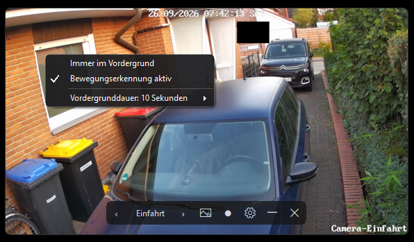
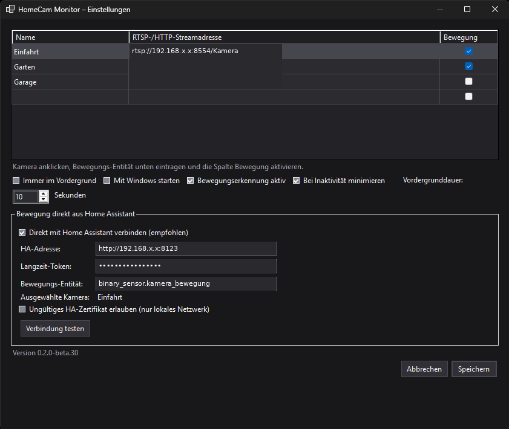

# HomeCamMonitor for Homeassistant

<p align="center">
  
</p>

<p align="center">
  Ein rahmenloser Windows-Kameramonitor für stabile RTSP-Livestreams – unabhängig vom Home-Assistant-Dashboard.
</p>

<p align="center">
  
</p>

HomeCamMonitor for Homeassistant verwendet die mpv-Video-Engine mit Direct3D 11. Das Fenster bleibt auf Wunsch im Vordergrund, verbindet einen abgebrochenen Stream automatisch neu und kann zwischen mehreren Kameras umschalten.

## Funktionen

- rahmenloses Kamerafenster mit abgerundeten Ecken
- Bedienleiste nur bei Mausbewegung sichtbar
- Fenster durch Ziehen direkt im Kamerabild verschieben
- Größe an allen Kanten und Ecken ändern
- festes 16:9-Seitenverhältnis ohne Abschneiden des Kamerabildes
- Doppelklick zum Wechsel zwischen Fenster und Vollbild
- mehrere RTSP-, HTTP- oder HTTPS-Kameras
- Snapshot direkt im Windows-Bilderordner
- Videoaufnahme direkt im Windows-Videosordner (Beta)
- automatische Wiederverbindung nach einem Stream- oder Playerabbruch
- vorsorglicher Stream-Neustart nach fünf Minuten gegen zunehmende Verzögerung
- Fensterposition und Fenstergröße werden nach dem Verschieben oder Ändern sofort gespeichert und beim nächsten Start exakt wiederhergestellt
- gespeicherte Kameraauswahl
- optional „Immer im Vordergrund“ und Windows-Autostart

## Installation

1. In GitHub **Actions → Windows-Build** öffnen.
2. Den neuesten erfolgreichen Lauf auswählen.
3. Unter **Artifacts** die Datei `HomeCamMonitor-win-x64` herunterladen.
4. Das ZIP vollständig entpacken.
5. `HomeCamMonitor.exe` starten.

> Wichtig: Nicht nur die EXE kopieren. Der komplette entpackte Ordner einschließlich `mpv.exe` wird benötigt.

## Kameras einrichten

Beim ersten Start öffnet sich die Kameraliste. Für jede Kamera werden ein frei wählbarer Name und die vollständige Streamadresse eingetragen.

| Name | Beispieladresse |
|---|---|
| Einfahrt | `rtsp://192.168.x.x:8554/Einfahrt` |
| Garten | `rtsp://192.168.x.x:8554/Garten` |
| Garage | `rtsp://192.168.x.x:8554/Garage2` |

Die Beispiele verwenden den RTSP-Ausgang von go2rtc auf Port `8554`. Eine `onvif://`-Adresse gehört in die go2rtc-Konfiguration und ist keine direkt abspielbare Adresse für HomeCam Monitor.

Kameras lassen sich später über das Zahnrad ergänzen, ändern oder löschen. Die lokale Konfiguration liegt unter `%LOCALAPPDATA%\HomeCamMonitor\settings.json`.

## Bedienung

<p align="center">
  
</p>

Die Bedienleiste erscheint bei einer Mausbewegung und verschwindet nach kurzer Zeit wieder. Die Kamera-Pfeile werden geglättet, größer und exakt mittig gezeichnet; Größe und Klickflächen der Leiste bleiben unverändert. Auch die Rundungen der Leiste werden unter Windows 11 nativ geglättet dargestellt.

| Bedienung | Funktion |
|---|---|
| Im Kamerabild ziehen | Fenster verschieben |
| Kante oder Ecke ziehen | Fenstergröße ändern |
| Doppelklick ins Bild | Vollbild ein/aus |
| `‹` / `›` | vorherige/nächste Kamera |
| Rastersymbol (Beta) | 2×2-Ansicht mit bis zu vier Kameras ein-/ausschalten |
| Bildsymbol | Snapshot speichern |
| Weißer/roter Aufnahmepunkt (Beta) | Aufnahme starten; erneut anklicken zum Beenden und Speichern |
| Zahnrad | Einstellungen öffnen |
| Rechtsklick ins Bild (Beta) | Dunkles Kontextmenü mit „Immer im Vordergrund“, „Bewegungserkennung aktiv“ und Vordergrunddauer |
| `—` (Beta) | Fenster minimieren |
| `×` | Anwendung beenden |

Snapshots werden automatisch unter `%USERPROFILE%\Pictures\HomeCam Monitor` gespeichert. Im deutschen Windows-Explorer wird der Ordner als **Bilder → HomeCam Monitor** angezeigt.

Im **4-Kamera-Raster** zeigt die Beta bis zu vier gültig eingerichtete Kameras gleichzeitig. Nicht belegte Felder bleiben vollständig schwarz. Ein Doppelklick in das Raster schaltet die gesamte Rasteransicht in den Vollbildmodus und wieder zurück. Das Rastersymbol wechselt zurück zur Einzelansicht; Snapshot und Aufnahme werden dort wie gewohnt für die ausgewählte Kamera verwendet.

Videoaufnahmen der Beta werden als MKV-Dateien unter `%USERPROFILE%\Videos\HomeCam Monitor` gespeichert. Der kleine Aufnahmepunkt ist im Ruhezustand weiß und leuchtet während der Aufnahme rot. Ein erneuter Klick beendet und speichert die Aufnahme. Die Aufnahme nutzt einen eigenen mpv-Prozess, damit der für geringe Verzögerung deaktivierte Cache des Livebilds keine leeren Dateien mehr erzeugt.

## Lokaler Build

Voraussetzung: .NET 8 SDK.

```powershell
dotnet restore
dotnet publish HomeCamMonitor.csproj -c Release -r win-x64 --self-contained true -p:PublishSingleFile=false -o publish
```

Danach `publish\HomeCamMonitor.exe` starten. Der komplette Ordner `publish` wird benötigt.

## Beta: Bewegungserkennung über Home Assistant

> **Aktueller dokumentierter Beta-Stand:** `0.2.0-beta.37`. Die stabile Ausgabe bleibt getrennt.

Der zusätzliche Build `HomeCamMonitor-Beta.exe` kann bei einer Personenerkennung automatisch die gemeldete Kamera auswählen und das Kamerafenster nach vorne holen. Dazu muss **Bewegungserkennung aktiv** eingeschaltet und **Immer im Vordergrund** ausgeschaltet sein. Die Vordergrunddauer ist in den Einstellungen zwischen 3 und 300 Sekunden wählbar (Standard: 10 Sekunden). Eine weitere Erkennung startet diese Zeit erneut. Danach wird das Fenster je nach Option in den Hintergrund geschickt oder minimiert.

Das Einblenden bei Bewegung erfolgt ohne Aktivierung des Kamerafensters. Der Tastaturfokus bleibt daher beispielsweise beim Schreiben in Word oder Outlook erhalten.

Mit der standardmäßig aktivierten Einstellung **Vorherige Kamera wiederherstellen** merkt sich HomeCam Monitor die Kamera, die vor der ersten Bewegung ausgewählt war. Nach Ablauf der Vordergrunddauer wird diese Kamera wieder geöffnet. Beispiel: Ist **Einfahrt** ausgewählt und **Garten** meldet Bewegung, wird vorübergehend Garten angezeigt und anschließend wieder auf Einfahrt gewechselt. Weitere Bewegungen während dieser Zeit überschreiben die gemerkte Ausgangskamera nicht. Eine manuelle Bedienung bricht das automatische Zurückschalten ab.\n\nBei aktivem **Immer im Vordergrund** bleibt die manuell ausgewählte Kamera unverändert. Bei ausgeschalteter Bewegungserkennung werden Meldungen von Home Assistant ignoriert.

Eine erkannte Bewegung wird oben rechts im Kamerabild für genau eine Sekunde durch ein kleines laufendes Männchen mit transparentem Hintergrund angezeigt. Das schwarz-weiß konturierte Symbol bleibt auf hellen und dunklen Bildbereichen sichtbar. Bei jeder neuen Bewegung wird die einsekündige Anzeige erneut ausgelöst. Das Symbol erscheint auch bei aktivem **Immer im Vordergrund**, ohne dabei die ausgewählte Kamera zu wechseln.

Die Häkchen im dunklen Rechtsklickmenü werden geglättet und skalierbar gezeichnet, damit sie auch bei Windows-Anzeigeskalierung sauber aussehen. Per Rechtsklick ins Kamerabild lassen sich **Immer im Vordergrund** und **Bewegungserkennung aktiv** direkt umschalten. Ist die Option aktiv, bleibt das Fenster dauerhaft vorne und die Vordergrunddauer wird nicht verwendet. Ist sie inaktiv, kann die Dauer ebenfalls direkt im Kontextmenü gewählt werden.

Wird das Fenster während der zeitgesteuerten Vordergrundanzeige mit Maus oder Bedienleiste verwendet, wird das automatische Zurückstellen abgebrochen. So verschwindet das Fenster nicht während einer manuellen Bedienung.

Mit der Einstellung **Bei Inaktivität minimieren** wird das Fenster nach Ablauf der Vordergrunddauer minimiert, statt nur hinter andere Fenster gelegt zu werden. Stream und Bewegungserkennung laufen weiter. Bei der nächsten Bewegung wird das Fenster automatisch wiederhergestellt und nach vorne geholt. Die Option wirkt nur bei aktiver Bewegungserkennung und ausgeschaltetem **Immer im Vordergrund**.

Solange sich der Mauszeiger im Kamerafenster befindet, wird der Inaktivitäts-Countdown verlängert. Das Fenster minimiert sich dann nicht während der Betrachtung.

Solange das Einstellungsfenster geöffnet ist, wird die Inaktivitätsautomatik ebenfalls ausgesetzt. HomeCam Monitor und die Einstellungen bleiben während der Bearbeitung sichtbar.

Nur in der Beta ersetzt ein schlichtes Windows-Minimieren-Symbol den Vollbild-Button und minimiert das Fenster. Beim Wiederherstellen werden Bedienleiste, Verschiebefläche und Größenänderung sofort wieder aktiviert. Vollbild bleibt per Doppelklick ins Kamerabild verfügbar.

Beim ersten Start übernimmt die Beta einmalig die Kameraliste der stabilen Version. Anschließend speichert sie ihre Einstellungen getrennt unter `%LOCALAPPDATA%\HomeCamMonitor-Beta\settings.json`.

Der Beta-Build enthält nur `HomeCamMonitor-Beta-Setup.exe`. Die selbstextrahierende Datei installiert bzw. aktualisiert immer `C:\github_mk\HomeCamMonitor-Beta` und startet die Beta. Die persönlichen Einstellungen unter `%LOCALAPPDATA%\HomeCamMonitor-Beta` bleiben dabei erhalten.

Die EXE wird im GitHub-Build zusätzlich mit Microsoft Defender geprüft. Da sie nicht digital signiert ist, können Browser oder Windows trotzdem eine Reputationswarnung anzeigen. GitHub verpackt Actions-Artefakte beim Herunterladen grundsätzlich in ein ZIP; darin befindet sich nur die Setup-EXE.

### Direkte Home-Assistant-Verbindung

Die dauerhafte Lösung benötigt keine Notebook-IP, keinen eingehenden Port und keinen `rest_command` mehr. HomeCam Monitor baut selbst eine ausgehende WebSocket-Verbindung zu Home Assistant auf und überwacht den Bewegungssensor.

<p align="center">
  
</p>

In den Beta-Einstellungen wird **Direkt mit Home Assistant verbinden** aktiviert. Jede Kamera besitzt in der Kameratabelle eine eigene Checkbox **Bewegung**. Nach dem Anklicken einer Kamerazeile wird darunter die zugehörige Bewegungs-Entität eingetragen.

| Feld | Beispiel |
|---|---|
| HA-Adresse | `http://192.168.x.x:8123` |
| Langzeit-Token | in Home Assistant im Benutzerprofil erstellt |
| Bewegungs-Entität | beispielsweise `binary_sensor.camera_einfahrt_bewegung` |

Meldet eine aktivierte Entität Bewegung, wechselt HomeCam Monitor automatisch auf die zugehörige Kamera und holt deren Bild nach vorn. So können Einfahrt, Garten und Garage unabhängig voneinander eingerichtet werden. **Bewegungserkennung aktiv** bleibt der globale Hauptschalter für alle Kameras.

Das Langzeit-Token wird in Home Assistant im eigenen Benutzerprofil unter **Sicherheit → Langzeit-Zugriffstoken** erstellt. Es wird nur lokal in `%LOCALAPPDATA%\HomeCamMonitor-Beta\settings.json` gespeichert; diese Datei darf nicht weitergegeben oder veröffentlicht werden.

Nach dem Speichern verbindet sich HomeCam Monitor automatisch und stellt die Verbindung nach Unterbrechungen selbst wieder her. Die bisherige Home-Assistant-Automation und `rest_command.homecam_bewegung` können danach deaktiviert oder gelöscht werden.

Der Button **Verbindung testen** prüft Adresse, Zertifikat, Token und die eingetragene Bewegungs-Entität. Bei einer lokalen HTTPS-Adresse mit selbstsigniertem oder nicht zur IP passendem Zertifikat kann die Zertifikatsausnahme ausdrücklich aktiviert werden. Diese Ausnahme sollte ausschließlich im eigenen lokalen Netzwerk verwendet werden.

### Alte REST-Anbindung als Rückfallmöglichkeit

Ist die direkte Verbindung ausgeschaltet, bleibt die bisherige REST-Anbindung auf Port `8765` erhalten. HomeCam Monitor lauscht dafür auf allen Netzwerkadressen des Windows-PCs. Damit ein Wechsel der vom Router vergebenen Notebook-IP keine Änderung in Home Assistant erfordert, sollte der Router dem Notebook per **DHCP-Reservierung** dauerhaft dieselbe IPv4-Adresse zuweisen.

Alternativ kann ein im Heimnetz auflösbarer Rechnername verwendet werden. Den Windows-Rechnernamen zeigt der Befehl `hostname` an. Wenn beispielsweise `HOMECAM-NOTEBOOK.local` von Home Assistant erreichbar ist, lautet der REST-Befehl:

```yaml
rest_command:
  homecam_bewegung:
    url: "http://HOMECAM-NOTEBOOK.local:8765/motion?camera={{ kamera }}"
    method: POST
```

Falls der Name aus Home Assistant nicht erreichbar ist, wird stattdessen die im Router reservierte Adresse verwendet:

```yaml
    url: "http://192.168.x.x:8765/motion?camera={{ kamera }}"
```

Die bestehende Snapshot-Automation bleibt unverändert. Für HomeCam Monitor wird eine eigene Automation mit dem **Person**-Binärsensor der Einfahrt angelegt:

```yaml
alias: HomeCam Monitor – Person Einfahrt
description: Holt HomeCam Monitor bei einer Person nach vorne
triggers:
  - trigger: state
    entity_id: binary_sensor.PERSON_EINFAHRT
    to: "on"
conditions: []
actions:
  - action: rest_command.homecam_bewegung
    data:
      kamera: Einfahrt
mode: restart
```

`binary_sensor.PERSON_EINFAHRT` wird dabei durch die tatsächliche Entity-ID des Einfahrt-Sensors **Person** ersetzt. Jede neue Erkennung startet die in HomeCam Monitor eingestellte Vordergrunddauer erneut.

Falls Windows beim ersten Test keine Verbindung zulässt, Port `8765` einmalig in einer PowerShell mit Administratorrechten für das private Netzwerk freigeben:

```powershell
New-NetFirewallRule -DisplayName "HomeCam Monitor Beta" -Direction Inbound -Protocol TCP -LocalPort 8765 -Action Allow -Profile Private
```
