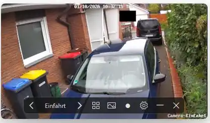
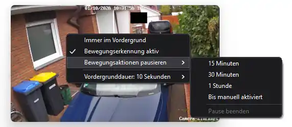
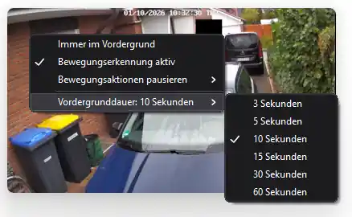
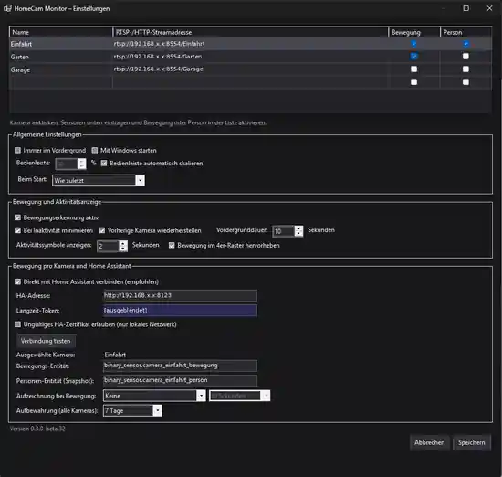

# HomeCamMonitor for Homeassistant

<p align="center">
  
</p>

<p align="center">
  Ein rahmenloser Windows-Kameramonitor für stabile RTSP-Livestreams – unabhängig vom Home-Assistant-Dashboard.
</p>

<p align="center">
  
</p>

HomeCamMonitor for Homeassistant verwendet die mpv-Video-Engine mit Direct3D 11. Das Fenster bleibt auf Wunsch im Vordergrund, verbindet einen abgebrochenen Stream automatisch neu und kann zwischen mehreren Kameras umschalten.

## Funktionen

- rahmenloses Kamerafenster mit abgerundeten Ecken
- Bedienleiste nur bei Mausbewegung sichtbar
- Fenster durch Ziehen direkt im Kamerabild verschieben
- Größe an allen Kanten und Ecken ändern
- festes 16:9-Seitenverhältnis ohne Abschneiden des Kamerabildes
- Doppelklick zum Wechsel zwischen Fenster und Vollbild
- mehrere RTSP-, HTTP- oder HTTPS-Kameras
- Snapshot direkt im Windows-Bilderordner
- Videoaufnahme direkt im Windows-Videosordner (Beta)
- automatische Wiederverbindung nach einem Stream- oder Playerabbruch
- nahtloser Stream-Refresh nach fünf Minuten per Double Buffering: ein neuer mpv-Stream übernimmt erst nach dem ersten Bild
- Fensterposition und Fenstergröße werden nach dem Verschieben oder Ändern sofort gespeichert und beim nächsten Start exakt wiederhergestellt
- gespeicherte Kameraauswahl
- direkter Home-Assistant-WebSocket mit Bewegungs- und Personen-Sensoren pro Kamera (Beta)
- Aktivitätssymbole und optionale Hervorhebung der auslösenden Kamera im 4er-Raster (Beta)
- automatische Bewegungsaktionen pro Kamera: Snapshot, Video oder beides mit Aufbewahrungsfrist (Beta)
- Bewegungsaktionen zeitweise direkt im Rechtsklickmenü pausieren (Beta)
- optional „Immer im Vordergrund“ und Windows-Autostart

## Installation

1. In GitHub **Actions → Windows-Build** öffnen.
2. Den neuesten erfolgreichen Lauf auswählen.
3. Unter **Artifacts** die Datei `HomeCamMonitor-win-x64` herunterladen.
4. Das ZIP vollständig entpacken.
5. `HomeCamMonitor.exe` starten.

> Wichtig: Nicht nur die EXE kopieren. Der komplette entpackte Ordner einschließlich `mpv.exe` wird benötigt.

## Kameras einrichten

Beim ersten Start öffnet sich die Kameraliste. Für jede Kamera werden ein frei wählbarer Name und die vollständige Streamadresse eingetragen.

| Name | Beispieladresse |
|---|---|
| Einfahrt | `rtsp://192.168.x.x:8554/Einfahrt` |
| Garten | `rtsp://192.168.x.x:8554/Garten` |
| Garage | `rtsp://192.168.x.x:8554/Garage2` |

Die Beispiele verwenden den RTSP-Ausgang von go2rtc auf Port `8554`. Eine `onvif://`-Adresse gehört in die go2rtc-Konfiguration und ist keine direkt abspielbare Adresse für HomeCam Monitor.

Kameras lassen sich später über das Zahnrad ergänzen, ändern oder löschen. Die lokale Konfiguration liegt unter `%LOCALAPPDATA%\HomeCamMonitor\settings.json`.

## Bedienung

<p align="center">
  
</p>

Die Bedienleiste erscheint bei einer Mausbewegung und verschwindet nach kurzer Zeit wieder. Die Kamera-Pfeile werden geglättet, größer und exakt mittig gezeichnet. Auch die Rundungen der Leiste werden unter Windows 11 nativ geglättet dargestellt. Bei 100 % bleibt das ursprüngliche Layout erhalten; Text und Symbole sind optisch mittig in der Leiste ausgerichtet.

In der Beta lässt sich die **Größe der Bedienleiste** in den Einstellungen von 50 bis 100 % wählen, beispielsweise 75 %. Die gesamte Leiste mit Symbolen und Klickflächen wird proportional verkleinert und bleibt mittig am unteren Fensterrand. Symbole und Text sind innerhalb der Leiste vertikal zentriert. Der Wechsel wirkt sofort und bleibt auch nach einem Neustart erhalten. Vorhandene Einstellungen bleiben standardmäßig bei 100 %.

| Bedienung | Funktion |
|---|---|
| Im Kamerabild ziehen | Fenster verschieben |
| Kante oder Ecke ziehen | Fenstergröße ändern |
| Doppelklick ins Bild | Vollbild ein/aus |
| `‹` / `›` | vorherige/nächste Kamera |
| Rastersymbol (Beta) | 2×2-Ansicht mit bis zu vier Kameras ein-/ausschalten |
| Bildsymbol | Snapshot speichern |
| Weißer/roter Aufnahmepunkt (Beta) | Aufnahme starten; erneut anklicken zum Beenden und Speichern |
| Zahnrad | Einstellungen öffnen |
| Rechtsklick ins Bild (Beta) | Dunkles Kontextmenü mit „Immer im Vordergrund“, „Bewegungserkennung aktiv“, „Bewegungsaktionen pausieren“ und Vordergrunddauer |
| `—` (Beta) | Fenster minimieren |
| `×` | Anwendung beenden |

### Kontextmenü für Bewegung

<p align="center">
  
  
</p>

Über **Bewegungsaktionen pausieren** lassen sich Kamerawechsel, Vordergrundreaktion sowie automatische Snapshots und Aufnahmen für **15 Minuten**, **30 Minuten** oder **1 Stunde** aussetzen. **Bis manuell aktiviert** schaltet die Bewegungserkennung bis zum manuellen Wiedereinschalten aus. Eine laufende Zeitpause kann über **Pause beenden** vorzeitig beendet werden. Sensorereignisse und Aktivitätssymbole bleiben während einer Zeitpause aktiv.

Die **Vordergrunddauer** lässt sich im Rechtsklickmenü schnell auf **3, 5, 10, 15, 30 oder 60 Sekunden** setzen. In den Einstellungen steht weiterhin der vollständige Bereich zur Verfügung.

Snapshots werden automatisch unter `%USERPROFILE%\Pictures\HomeCam Monitor` gespeichert. Im deutschen Windows-Explorer wird der Ordner als **Bilder → HomeCam Monitor** angezeigt.

Im **4-Kamera-Raster** zeigt die Beta bis zu vier gültig eingerichtete Kameras gleichzeitig. Nicht belegte Felder zeigen die schwarze **HomeCamMonitor-Platzhalterkachel**. Ein Doppelklick in das Raster schaltet die gesamte Rasteransicht in den Vollbildmodus und wieder zurück. Das Rastersymbol wechselt zurück zur Einzelansicht; Snapshot und Aufnahme werden dort wie gewohnt für die ausgewählte Kamera verwendet.

<p align="center">
  
</p>

Videoaufnahmen der Beta werden als MKV-Dateien unter `%USERPROFILE%\Videos\HomeCam Monitor` gespeichert. Der kleine Aufnahmepunkt ist im Ruhezustand weiß und leuchtet während der Aufnahme rot. Ein erneuter Klick beendet und speichert die Aufnahme. Die Aufnahme nutzt einen eigenen mpv-Prozess, damit der für geringe Verzögerung deaktivierte Cache des Livebilds keine leeren Dateien mehr erzeugt.

## Lokaler Build

Voraussetzung: .NET 8 SDK.

```powershell
dotnet restore
dotnet publish HomeCamMonitor.csproj -c Release -r win-x64 --self-contained true -p:PublishSingleFile=false -o publish
```

Danach `publish\HomeCamMonitor.exe` starten. Der komplette Ordner `publish` wird benötigt.

## Beta: Bewegungserkennung über Home Assistant

> **Aktueller Entwicklungsstand:** `0.3.0-beta.32`. Die stabile Ausgabe bleibt getrennt.

### Neu in 0.3.0 Beta 32

- Der aktuelle Stand des geglätteten Rechtsklickmenüs einschließlich der abgerundeten Untermenüs ist als `0.3.0-beta.32` paketiert.
- Die Dokumentation und Screenshots wurden auf den aktuellen Bedien- und Einstellungsstand gebracht.

### Neu in 0.3.0 Beta 31

- Haupt- und Untermenüs erhalten den für geglättete Windows-11-Rundungen nötigen Fensterstil; die halbtransparente Popup-Ebene entfällt. Der Inhalt bleibt bis an den Rand des Menüs nutzbar.

### Neu in 0.3.0 Beta 30

- Das Rechtsklickmenü und seine Untermenüs verwenden unter Windows 11 geglättete Systemrundungen statt eines pixeligen Fensterausschnitts. Die Untermenü-Pfeile werden ebenfalls geglättet.
- „Pause beenden“ im Untermenü schaltet nach „Bis manuell aktiviert“ die Bewegungserkennung wieder ein.

### Neu in 0.3.0 Beta 29

- Rechtsklickmenü: „Bewegungsaktionen pausieren“ für 15 Minuten, 30 Minuten oder eine Stunde. Sensorereignisse und Aktivitätssymbole bleiben aktiv; Kamerawechsel, Vordergrundreaktion und automatische Snapshots/Aufnahmen pausieren.
- „Bis manuell aktiviert“ schaltet den vorhandenen globalen Schalter „Bewegungserkennung aktiv“ aus. Er wird im Menü oder in den Einstellungen wieder eingeschaltet.
- Zeitpausen bleiben nach einem Neustart bis zu ihrem Ablauf erhalten und können im Menü vorzeitig beendet werden.

### Neu in 0.3.0 Beta 28

- Der planmäßige Stream-Refresh nach fünf Minuten startet eine zweite mpv-Instanz im Hintergrund. Erst nach dem ersten Videobild wird umgeschaltet und die bisherige Instanz beendet.
- Im 4er-Raster werden die Kameras nacheinander erneuert. Schlägt ein Ersatzstream fehl, läuft die bisherige Wiedergabe weiter; der nächste Versuch erfolgt beim folgenden Intervall.
- Beim manuellen Kamerawechsel und beim Schließen werden laufende Hintergrund-Refreshs abgebrochen.

### Neu in 0.3.0 Beta 27

- Die vier Rastervideos füllen ihre Felder auch bei kleinen Rundungsunterschieden nach einer Größenänderung vollständig aus. Ein minimaler Rand des Kamerabilds kann dabei abgeschnitten werden.
- Die wirkungslose Änderung am Fensterschatten aus Beta 26 wurde zurückgenommen.

### Neu in 0.3.0 Beta 26

- Der äußere DWM-Schatten des Kamerafensters wird deaktiviert. Das 4er-Raster bleibt bis an die Fensterkante ausgerichtet.

### Neu in 0.3.0 Beta 25

- **Schatten der Hilfsfenster entfernt:** Die unsichtbaren Fenster zum Verschieben und Ändern der Größe erhalten keine eigene Windows-Rahmenzeichnung mehr. Die abgerundeten Ecken des Kamerafensters bleiben davon unberührt.

### Neu in 0.3.0 Beta 24

- **Raster bei Größenänderung ausrichten:** Die vier Kamerafelder werden bei jeder Änderung und nach Abschluss der Größenänderung an der aktuellen Fensterfläche ausgerichtet. Eine kurze Nachprüfung fängt verzögerte Windows-Layouts ab.

### Neu in 0.3.0 Beta 23

- **Fensterrand an der Ursache korrigiert:** Die zusätzlichen Windows-Rahmenstile, die einen Innenabstand um das gesamte Raster erzeugten, sind entfernt. Die native Rundung bleibt angefordert; das Raster nutzt wieder die vollständige Fensterfläche.

### Neu in 0.3.0 Beta 22

- **Raster nach dem Start ausrichten:** Nach dem Anzeigen der ausgewählten Rasterkameras wird einmal eine echte Größenänderung um einen Pixel und zurück ausgeführt. Das Fenster behält seine Außenmaße und die geglätteten Ecken.

### Neu in 0.3.0 Beta 21

- **Raster direkt beim Start bündig:** Die Windows-11-Fensterfläche wird nach dem Öffnen erneut berechnet, bevor die Kameras starten. Damit füllt das Bild den abgerundeten Rahmen bereits beim ersten Anzeigen bis rechts und unten aus.

### Neu in 0.3.0 Beta 20

- **Fenstergröße korrigiert:** Die Höhe wird auch mit den geglätteten Windows-11-Ecken aus den äußeren Fenstermaßen berechnet und wächst beim Verschieben oder wiederholten Ändern der Größe nicht mehr.

### Neu in 0.3.0 Beta 19

- **Geglättete Fensterecken unter Windows 11:** Das Kamerafenster überlässt die Rundung Windows statt einer pixelgenau ausgeschnittenen GDI-Form. Die Randlinie bleibt ausgeblendet; im Vollbild bleiben die Ecken gerade. Auf älteren Windows-Versionen bleibt die bisherige Rundung.

### Neu in 0.3.0 Beta 18

- **Übersichtlichere Einstellungen:** Allgemeines Fensterverhalten, Bewegung und Aktivitätsanzeige sowie die Einstellungen der ausgewählten Kamera stehen in eigenen Bereichen. „Aktivitätssymbole anzeigen“ ersetzt „Symbole anzeigen“; „Aufzeichnung bei Bewegung“ beginnt links in der Zeile vor den Auswahlfeldern. Die Aufbewahrungsdauer steht direkt darunter.

### Neu in 0.3.0 Beta 17

- **Rastermitte:** Alle vier Kamerafelder teilen sich auch bei ungerader Fenstergröße dieselbe Pixelmitte.

### Neu in 0.3.0 Beta 16

- **Bewegungsrahmen im Kamerabild:** Die kurze weiße Markierung wird als schmale Linie innerhalb des betroffenen Rasterfeldes gezeichnet. Dafür öffnet HomeCam kein zusätzliches Fenster um oder über dem Kamerabild. Der dauerhafte äußere Fensterrand bleibt entfernt.

### Neu in 0.3.0 Beta 15

- **Kurzzeitiger Bewegungsrahmen:** Ist „Bewegung im 4er-Raster hervorheben“ eingeschaltet, bekommt nur das betroffene sichtbare Kamerafeld bei Bewegung für die eingestellte Symboldauer einen weißen Rahmen und das laufende Männchen. Der Rahmen erscheint nie dauerhaft und nicht um das ganze HomeCam-Fenster. Die dauerhaften Zwischen- und Außenränder bleiben entfernt.

### Neu in 0.3.0 Beta 14

- **Raster ohne Ränder:** Die dauerhaften Zwischen- und Außenabstände zwischen den Kamerafeldern entfallen. Unter Windows 11 wird der Systemrahmen des abgerundeten HomeCam-Fensters unterdrückt.
- **Bewegung im Raster:** Die Markierung wird nur bei einem Bewegungssignal im betroffenen Feld angezeigt; die Option bleibt standardmäßig aus.

### Neu in 0.3.0 Beta 13

- **Anzeigedauer der Symbole:** Das Bewegungs- und Personensymbol erscheint standardmäßig zwei Sekunden. Unter „Allgemeine Einstellungen → Symbole anzeigen“ lässt sich die Dauer von 1 bis 10 Sekunden wählen.
- **Bewegung im 4er-Raster:** Die Option „Bewegung im 4er-Raster hervorheben“ ist standardmäßig aus. Eingeschaltet erhält das betroffene sichtbare Kamerafeld bei Bewegung einen weißen Rahmen und das Bewegungssymbol oben rechts im Feld. Das Raster bleibt geöffnet. Die Hervorhebung verschwindet nach der eingestellten Symboldauer.
- **Sensoren ausschalten:** Die Kästchen „Bewegung“ und „Person“ unterdrücken die Auswertung der jeweiligen Home-Assistant-Ereignisse. Die WebSocket-Verbindung abonniert weiterhin die gemeinsamen Statusereignisse, solange mindestens ein Sensor aktiv ist; es findet keine separate Abfrage jedes Sensors statt.

### Neu in 0.3.0 Beta 12

- **Getrennte Kästchen pro Kamera:** Die Kameraliste enthält „Bewegung“ und „Person“. Beide Sensoren können unabhängig aktiviert werden. Bei einem Update bleiben bereits eingerichtete Personensensoren eingeschaltet. Die allgemeine Bewegungserkennung und die direkte HA-Verbindung müssen für beide aktiv sein.
- **Sekundenfeld:** Die Auswahlliste für die Dauer der Bewegungsaufnahme ist breiter.

### Neu in 0.3.0 Beta 11

- **Personensymbol:** Bei einem Ereignis des eingetragenen Personensensors erscheint eine Sekunde lang eine weiße, stehende Person oben rechts im HomeCam-Fenster. Das bisherige Bewegungssymbol bleibt als laufende Person erhalten. Die Personenerkennung ändert weder die ausgewählte Kamera noch die Vordergrundsteuerung.

### Neu in 0.3.0 Beta 10

- **Personenerkennung pro Kamera:** In den Einstellungen die Kamera auswählen und unter „Personen-Entität (Snapshot)“ die Home-Assistant-Entitäts-ID ihres Personensensors eintragen (z. B. `binary_sensor.camera_einfahrt_person`). Beim Wechsel dieses Sensors auf `on` wird ein PNG mit „Person“ im Dateinamen unter `Videos\HomeCam Monitor\Bewegung` gespeichert. Dafür muss die direkte Home-Assistant-Verbindung eingeschaltet sein. Das gilt unabhängig von der gewählten Aktion „Bei Bewegung“.
- **Anzeige wie bisher:** Der Personensensor wechselt keine Kamera und holt das Fenster nicht in den Vordergrund. Dafür bleibt allein der Bewegungssensor zuständig. Der Verbindungstest prüft beide eingetragenen Entitäten.

### Neu in 0.3.0 Beta 9

- **Automatische Snapshots:** Das Bewegungsbild wird mit dem enthaltenen FFmpeg direkt aus dem Kamerastream als PNG gespeichert. Eine beschädigte oder leere Datei wird entfernt und als Fehler angezeigt.

### Neu in 0.3.0 Beta 8

- **Aktion pro Kamera bei Bewegung:** In der Kameratabelle eine Kamera anklicken und „Keine“, „Snapshot“, „Videoaufnahme“ oder „Snapshot + Videoaufnahme“ wählen. Die Spalte **Bewegung** muss für die Kamera aktiviert sein. Ein Snapshot speichert genau ein Bild je Ereignis. Für Video sind 15, 30 oder 60 Sekunden wählbar.
- **Eigener Bewegungsordner:** Automatische Dateien liegen unter `Videos\HomeCam Monitor\Bewegung`. Manuell erstellte Snapshots und Videos liegen weiterhin in ihren bisherigen Ordnern.
- **Aufbewahrung:** 1, 3, 7, 14 oder 30 Tage sowie „Unbegrenzt“. Alte automatische Dateien werden beim Start und bei neuen Bewegungsereignissen gelöscht. Manuelle Dateien werden nie durch diese Einstellung gelöscht.
- **Aufnahmeanzeige:** Der rote Punkt der Bedienleiste blinkt während manueller und automatischer Videoaufnahmen. Bei einer automatischen Aufnahme zeigt sein Hilfetext den laufenden Hintergrundvorgang an.
- **Einstellungsfenster:** Größerer Startwert und Wiederherstellung der zuletzt verwendeten Größe, auch wenn das Fenster mit „Abbrechen“ geschlossen wurde.
- **Abspielbare Bewegungsaufnahmen:** Automatische Videos werden mit FFmpeg als Matroska-Datei abgeschlossen. Bei einem Fehler wird die unvollständige Datei entfernt. Die Beta-Downloads enthalten dafür `ffmpeg.exe` aus dem [LGPL-Windows-Build von BtbN](https://github.com/BtbN/FFmpeg-Builds); Quellcode und Lizenzhinweise sind dort verfügbar.
- Die Hervorhebung einer Bewegung im 4er-Raster ist für eine spätere Version vorgemerkt.

### Neu in Beta 45

- **Einstellungen aufgeräumt:** Die Optionen stehen in festen Zeilen. Der Hinweis unter der Kameratabelle bleibt sichtbar, und die Einheit „Sekunden“ steht direkt neben der Vordergrunddauer. Die Startkamera erscheint nur bei „Mit Kamera starten“. Die Schaltflächen schließen das Formular ohne unnötige Leerfläche ab.

### Neu in Beta 44

- **Monitor merken:** Die Beta speichert, auf welchem Bildschirm das Fenster zuletzt war, samt Größe und Position relativ zu dessen Arbeitsfläche. Das funktioniert auch für Monitore links oder oberhalb des Hauptbildschirms. Wenn dieser Monitor fehlt, erscheint das Fenster auf einem verfügbaren Bildschirm.
- **Startverhalten:** Unter **Beim Start** stehen „Wie zuletzt“, „Minimiert starten“, „Mit Kamera starten“ (mit Kameraauswahl) und „Raster starten“ zur Wahl. „Wie zuletzt“ übernimmt die letzte Einzel- oder Rasteransicht und die zuletzt gewählte Kamera. Für das Raster sind mindestens zwei gültige Kameras erforderlich; sonst startet die Einzelansicht.

### Neu in Beta 43

- **Bedienleiste automatisch skalieren:** In den Einstellungen per Häkchen aktivierbar. Bei kleinen Kamerafenstern wird die gesamte Leiste einschließlich Schaltflächen, Symbolen und Schrift passend verkleinert; ab 340 Pixel Fensterbreite erreicht sie wieder 100 %.
- Ohne Häkchen bleibt die manuell gewählte Größe von 50 bis 100 % erhalten. Die manuelle Einstellung wird gespeichert und nach dem Ausschalten der Automatik wieder verwendet.


### Neu in Beta 39–42

- **Bedienleiste skalierbar:** 50 bis 100 % in 5-%-Schritten, einschließlich 75 %.
- **Sofortige Vorschau:** Änderungen an der Bedienleistengröße werden direkt nach dem Speichern übernommen.
- **Sauber nach Neustart:** Eine verkleinerte Leiste startet wieder mit derselben Größe; der Wechsel zurück auf 100 % stellt das ursprüngliche Layout korrekt wieder her.
- **Korrekte Fensterhöhe:** Die Leiste bleibt auch beim ersten Anzeigen nach dem Programmstart passend zur gewählten Skalierung.
- **Vertikal zentriert:** Kamera-Pfeile, Raster-Symbol, Text und übrige Bedienelemente sitzen auch bei verkleinerter Leiste mittig.
- **Automatischer Build-Test:** Der GitHub-Build prüft die Darstellung der skalierten Bedienleiste zusätzlich automatisch.

Der zusätzliche Build `HomeCamMonitor-Beta.exe` kann bei einer Personenerkennung automatisch die gemeldete Kamera auswählen und das Kamerafenster nach vorne holen. Dazu muss **Bewegungserkennung aktiv** eingeschaltet und **Immer im Vordergrund** ausgeschaltet sein. Die Vordergrunddauer ist in den Einstellungen zwischen 3 und 300 Sekunden wählbar (Standard: 10 Sekunden). Eine weitere Erkennung startet diese Zeit erneut. Danach wird das Fenster je nach Option in den Hintergrund geschickt oder minimiert.

Das Einblenden bei Bewegung erfolgt ohne Aktivierung des Kamerafensters. Der Tastaturfokus bleibt daher beispielsweise beim Schreiben in Word oder Outlook erhalten.

Mit der standardmäßig aktivierten Einstellung **Vorherige Kamera wiederherstellen** merkt sich HomeCam Monitor die Kamera, die vor der ersten Bewegung ausgewählt war. Nach Ablauf der Vordergrunddauer wird diese Kamera wieder geöffnet. Beispiel: Ist **Einfahrt** ausgewählt und **Garten** meldet Bewegung, wird vorübergehend Garten angezeigt und anschließend wieder auf Einfahrt gewechselt. Weitere Bewegungen während dieser Zeit überschreiben die gemerkte Ausgangskamera nicht. Eine manuelle Bedienung bricht das automatische Zurückschalten ab.

Bei aktivem **Immer im Vordergrund** bleibt die manuell ausgewählte Kamera unverändert. Bei ausgeschalteter Bewegungserkennung werden Meldungen von Home Assistant ignoriert.

Eine erkannte Bewegung wird oben rechts im Kamerabild für genau eine Sekunde durch ein kleines laufendes Männchen mit transparentem Hintergrund angezeigt. Das schwarz-weiß konturierte Symbol bleibt auf hellen und dunklen Bildbereichen sichtbar. Bei jeder neuen Bewegung wird die einsekündige Anzeige erneut ausgelöst. Das Symbol erscheint auch bei aktivem **Immer im Vordergrund**, ohne dabei die ausgewählte Kamera zu wechseln.

Die Häkchen im dunklen Rechtsklickmenü werden geglättet und skalierbar gezeichnet, damit sie auch bei Windows-Anzeigeskalierung sauber aussehen. Per Rechtsklick ins Kamerabild lassen sich **Immer im Vordergrund** und **Bewegungserkennung aktiv** direkt umschalten. Ist die Option aktiv, bleibt das Fenster dauerhaft vorne und die Vordergrunddauer wird nicht verwendet. Ist sie inaktiv, kann die Dauer ebenfalls direkt im Kontextmenü gewählt werden.

Wird das Fenster während der zeitgesteuerten Vordergrundanzeige mit Maus oder Bedienleiste verwendet, wird das automatische Zurückstellen abgebrochen. So verschwindet das Fenster nicht während einer manuellen Bedienung.

Mit der Einstellung **Bei Inaktivität minimieren** wird das Fenster nach Ablauf der Vordergrunddauer minimiert, statt nur hinter andere Fenster gelegt zu werden. Stream und Bewegungserkennung laufen weiter. Bei der nächsten Bewegung wird das Fenster automatisch wiederhergestellt und nach vorne geholt. Die Option wirkt nur bei aktiver Bewegungserkennung und ausgeschaltetem **Immer im Vordergrund**.

Solange sich der Mauszeiger im Kamerafenster befindet, wird der Inaktivitäts-Countdown verlängert. Das Fenster minimiert sich dann nicht während der Betrachtung.

Solange das Einstellungsfenster geöffnet ist, wird die Inaktivitätsautomatik ebenfalls ausgesetzt. HomeCam Monitor und die Einstellungen bleiben während der Bearbeitung sichtbar.

Nur in der Beta ersetzt ein schlichtes Windows-Minimieren-Symbol den Vollbild-Button und minimiert das Fenster. Beim Wiederherstellen werden Bedienleiste, Verschiebefläche und Größenänderung sofort wieder aktiviert. Vollbild bleibt per Doppelklick ins Kamerabild verfügbar.

Beim ersten Start übernimmt die Beta einmalig die Kameraliste der stabilen Version. Anschließend speichert sie ihre Einstellungen getrennt unter `%LOCALAPPDATA%\HomeCamMonitor-Beta\settings.json`.

Der Beta-Build enthält nur `HomeCamMonitor-Beta-Setup.exe`. Die selbstextrahierende Datei installiert bzw. aktualisiert immer `C:\github_mk\HomeCamMonitor-Beta` und startet die Beta. Die persönlichen Einstellungen unter `%LOCALAPPDATA%\HomeCamMonitor-Beta` bleiben dabei erhalten.

Die EXE wird im GitHub-Build zusätzlich mit Microsoft Defender geprüft. Da sie nicht digital signiert ist, können Browser oder Windows trotzdem eine Reputationswarnung anzeigen. GitHub verpackt Actions-Artefakte beim Herunterladen grundsätzlich in ein ZIP; darin befindet sich nur die Setup-EXE.

### Direkte Home-Assistant-Verbindung

Die dauerhafte Lösung benötigt keine Notebook-IP, keinen eingehenden Port und keinen `rest_command` mehr. HomeCam Monitor baut selbst eine ausgehende WebSocket-Verbindung zu Home Assistant auf und überwacht den Bewegungssensor.

<p align="center">
  
</p>

In den Beta-Einstellungen wird **Direkt mit Home Assistant verbinden** aktiviert. Jede Kamera besitzt in der Kameratabelle eigene Checkboxen für **Bewegung** und **Person**. Nach dem Anklicken einer Kamerazeile werden darunter die zugehörige **Bewegungs-Entität** und – falls gewünscht – die **Personen-Entität** eingetragen. Zusätzlich lassen sich pro Kamera automatische Bewegungsaufzeichnungen konfigurieren sowie eine gemeinsame Aufbewahrungsfrist festlegen.

| Feld | Beispiel |
|---|---|
| HA-Adresse | `http://192.168.x.x:8123` |
| Langzeit-Token | in Home Assistant im Benutzerprofil erstellt |
| Bewegungs-Entität | beispielsweise `binary_sensor.camera_einfahrt_bewegung` |
| Personen-Entität | beispielsweise `binary_sensor.camera_einfahrt_person` |

Meldet eine aktivierte Entität Bewegung, wechselt HomeCam Monitor automatisch auf die zugehörige Kamera und holt deren Bild nach vorn. Die Personenerkennung kann separat pro Kamera aktiviert werden und wird unter anderem für den Personen-Snapshot verwendet. So können Einfahrt, Garten und Garage unabhängig voneinander eingerichtet werden. **Bewegungserkennung aktiv** bleibt der globale Hauptschalter für alle Kameras. Die Einstellungen enthalten außerdem die automatische Bedienleistenskalierung, das Startverhalten, die Dauer der Aktivitätssymbole und die optionale Hervorhebung im 4er-Raster.

Das Langzeit-Token wird in Home Assistant im eigenen Benutzerprofil unter **Sicherheit → Langzeit-Zugriffstoken** erstellt. Es wird nur lokal in `%LOCALAPPDATA%\HomeCamMonitor-Beta\settings.json` gespeichert; diese Datei darf nicht weitergegeben oder veröffentlicht werden.

Nach dem Speichern verbindet sich HomeCam Monitor automatisch und stellt die Verbindung nach Unterbrechungen selbst wieder her. Die bisherige Home-Assistant-Automation und `rest_command.homecam_bewegung` können danach deaktiviert oder gelöscht werden.

Der Button **Verbindung testen** prüft Adresse, Zertifikat, Token und die eingetragene Bewegungs-Entität. Bei einer lokalen HTTPS-Adresse mit selbstsigniertem oder nicht zur IP passendem Zertifikat kann die Zertifikatsausnahme ausdrücklich aktiviert werden. Diese Ausnahme sollte ausschließlich im eigenen lokalen Netzwerk verwendet werden.

### Alte REST-Anbindung als Rückfallmöglichkeit

Ist die direkte Verbindung ausgeschaltet, bleibt die bisherige REST-Anbindung auf Port `8765` erhalten. HomeCam Monitor lauscht dafür auf allen Netzwerkadressen des Windows-PCs. Damit ein Wechsel der vom Router vergebenen Notebook-IP keine Änderung in Home Assistant erfordert, sollte der Router dem Notebook per **DHCP-Reservierung** dauerhaft dieselbe IPv4-Adresse zuweisen.

Alternativ kann ein im Heimnetz auflösbarer Rechnername verwendet werden. Den Windows-Rechnernamen zeigt der Befehl `hostname` an. Wenn beispielsweise `HOMECAM-NOTEBOOK.local` von Home Assistant erreichbar ist, lautet der REST-Befehl:

```yaml
rest_command:
  homecam_bewegung:
    url: "http://HOMECAM-NOTEBOOK.local:8765/motion?camera={{ kamera }}"
    method: POST
```

Falls der Name aus Home Assistant nicht erreichbar ist, wird stattdessen die im Router reservierte Adresse verwendet:

```yaml
    url: "http://192.168.x.x:8765/motion?camera={{ kamera }}"
```

Die bestehende Snapshot-Automation bleibt unverändert. Für HomeCam Monitor wird eine eigene Automation mit dem **Person**-Binärsensor der Einfahrt angelegt:

```yaml
alias: HomeCam Monitor – Person Einfahrt
description: Holt HomeCam Monitor bei einer Person nach vorne
triggers:
  - trigger: state
    entity_id: binary_sensor.PERSON_EINFAHRT
    to: "on"
conditions: []
actions:
  - action: rest_command.homecam_bewegung
    data:
      kamera: Einfahrt
mode: restart
```

`binary_sensor.PERSON_EINFAHRT` wird dabei durch die tatsächliche Entity-ID des Einfahrt-Sensors **Person** ersetzt. Jede neue Erkennung startet die in HomeCam Monitor eingestellte Vordergrunddauer erneut.

Falls Windows beim ersten Test keine Verbindung zulässt, Port `8765` einmalig in einer PowerShell mit Administratorrechten für das private Netzwerk freigeben:

```powershell
New-NetFirewallRule -DisplayName "HomeCam Monitor Beta" -Direction Inbound -Protocol TCP -LocalPort 8765 -Action Allow -Profile Private
```
